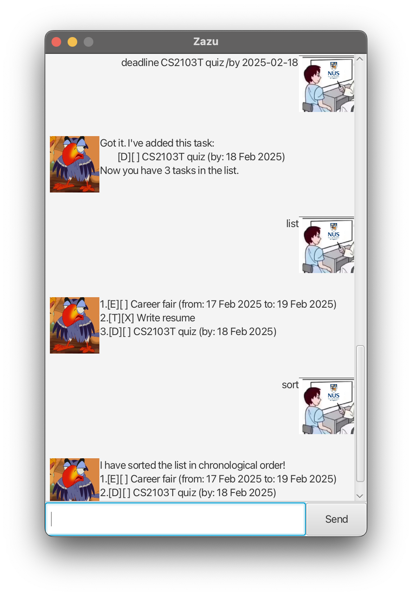

# Zazu User Guide

The Zazu chatbot manages your tasks for you. 

## Quick start

1. Make sure that you have Java `17` or above installed. 
2. Download the `.jar` file from the release page.
3. Use the command `java -jar zazu.jar` to run the application. 

## Features

### Show the task list: `list`
Format: `list`

### Add a todo item with no date: `todo`
Format: `todo DESCRIPTION`

Example: `todo laundry`

### Add an item with a deadline: `deadline`
Format: `deadline DESCRIPTION /by yyyy-MM-dd`
The `/by` indicates the deadline.
>:warning: The date must be in the format yyyy-MM-dd!

Example: `deadline HW /by 2025-02-28`

### Add an event item with start and end dates: `event`
Format: `event DESCRIPTION /from yyyy-MM-dd /to yyyy-MM-dd`
The `/from` and `/to` indicate the start and end dates respectively. They must be in the correct order as shown above. 
>:warning: The dates must be in the format yyyy-MM-dd!

Example: `event career fair /from 2025-02-10 /to 2025-02-11`
### Mark an item as done: `mark`
Format: `mark INDEX`

Mark the `INDEX`-th (1-based indexing) in the list as done.

Example: `mark 2`

### Delete an item: `delete`
Format: `delete INDEX`

Delete the `INDEX`-th (1-based indexing) in the list.

Example: `delete 2`

### Search for items by their descriptions: `find`
Format: `find KEYWORD`

Search for all items whose descriptions contains the given keyword. 
> :warning:
> The search is case-sensitive. 
> Any manner of containment of the keyword is considered, e.g. "deadline" contains "line". 

find: `find HW`

### Sort the list in chronological order: `sort`
Format: `sort`
This sorts the list in chronological order with respect to the deadline and start dates. Items with no date are moved to the end of the list. 

### Exit the application: `bye`
Format: `bye`